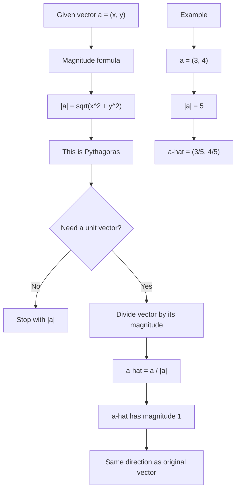

# AS1VectorsMermaid-005

## Asset ID
AS1VectorsMermaid-005

## Source
P1-Chp11-Vectors.pdf, Magnitude and Unit Vectors slides; Chapter_11_Vectors transcript.

## Related lesson section
Core Theory: Magnitude of a vector; Unit vectors; Worked Examples 7 and 8.

## Purpose
Show the calculation pathway from component form to magnitude and then to a unit vector.

