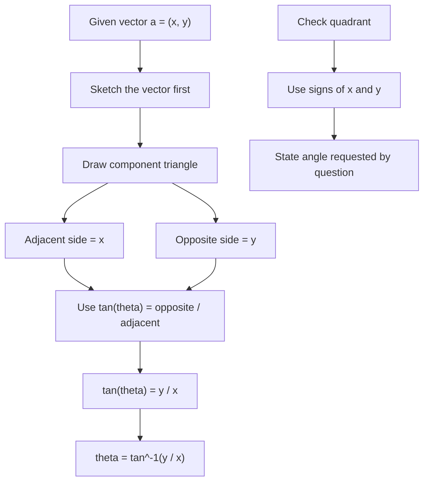

# AS1VectorsMermaid-006

## Asset ID
AS1VectorsMermaid-006

## Source
P1-Chp11-Vectors.pdf, Direction of vectors content; Chapter_11_Vectors transcript.

## Related lesson section
Core Theory: Direction of a vector; Exam Technique.

## Purpose
Show how to find the angle a vector makes with the positive x-axis using a component triangle.

