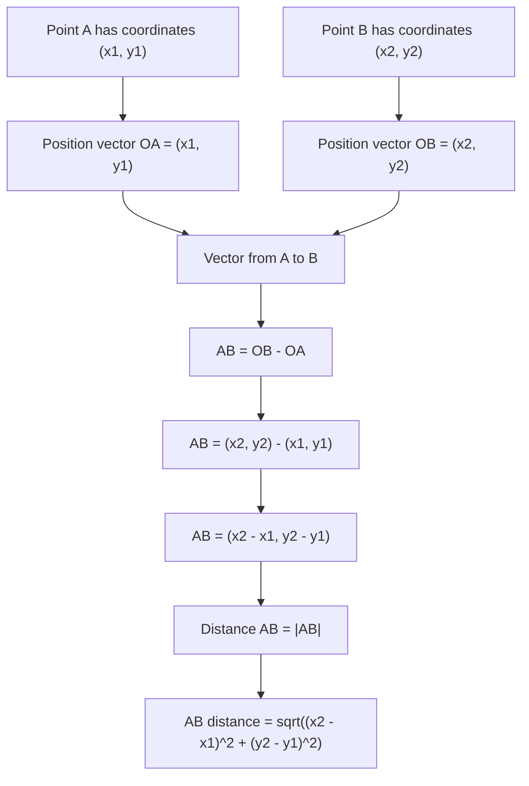

# AS1VectorsMermaid-007

## Asset ID
AS1VectorsMermaid-007

## Source
P1-Chp11-Vectors.pdf, Position Vectors slides.

## Related lesson section
Core Theory: Position vectors and vector differences; Worked Examples 9 and 10.

## Purpose
Show how position vectors from the origin lead to the vector difference formula AB = OB - OA.

