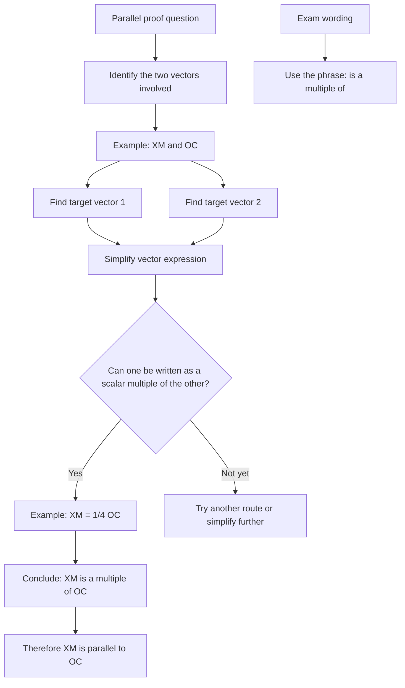

# AS1VectorsMermaid-008

## Asset ID
AS1VectorsMermaid-008

## Source
P1-Chp11-Vectors.pdf, Solving Geometric Problems slide; Chapter_11_Vectors transcript.

## Related lesson section
Worked Example 11; Common Mistakes and Exam Traps.

## Purpose
Show the proof workflow for proving two line segments are parallel using scalar multiples.

