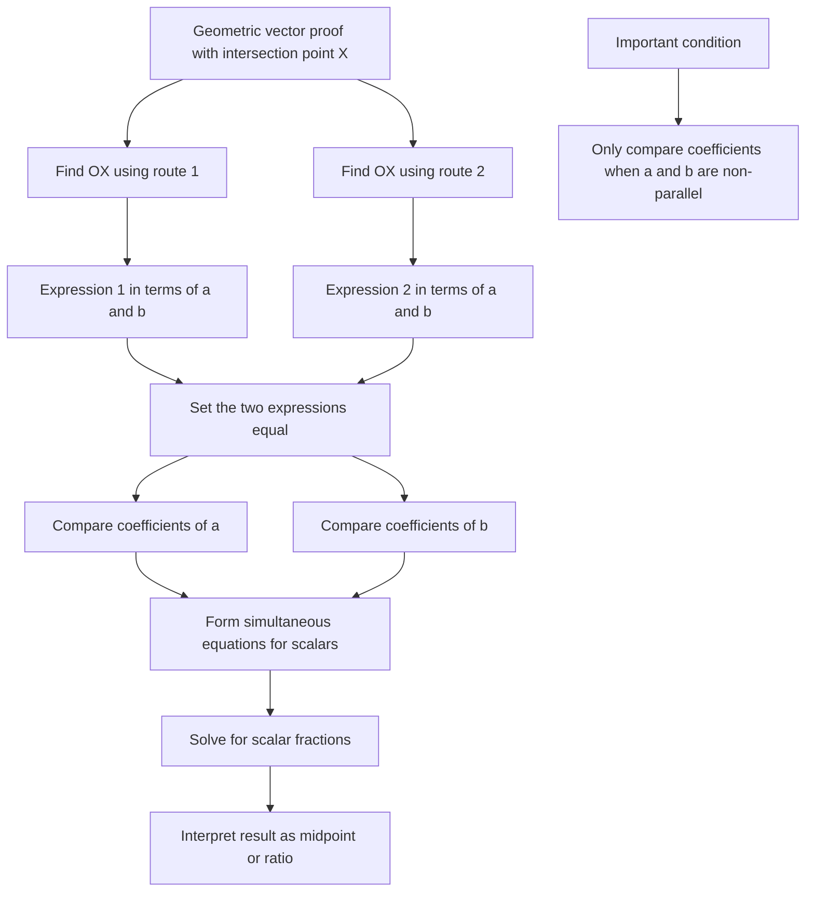

# AS1VectorsMermaid-009

## Asset ID
AS1VectorsMermaid-009

## Source
P1-Chp11-Vectors.pdf, Introducing Scalars and Comparing Coefficients slide.

## Related lesson section
Worked Example 12; Worked Example 13.

## Purpose
Show the method of finding the same position vector in two ways and comparing coefficients of non-parallel vectors.

