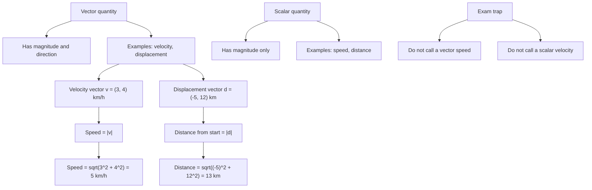

# AS1VectorsMermaid-010

## Asset ID
AS1VectorsMermaid-010

## Source
P1-Chp11-Vectors.pdf, Modelling slide; Chapter_11_Vectors transcript.

## Related lesson section
Worked Example 15; Common Mistakes and Exam Traps; Exam Technique.

## Purpose
Show the modelling distinction between vector quantities and scalar quantities, especially velocity versus speed and displacement versus distance.

