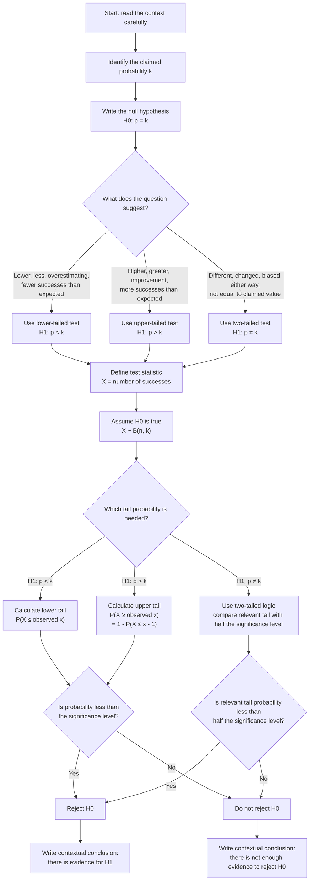

# A22StatisticalHypothesisTestingMermaid-001

## Asset metadata

| Field | Value |
|---|---|
| Asset ID | `A22StatisticalHypothesisTestingMermaid-001` |
| Asset type | Mermaid flowchart |
| Unit code | `A22` |
| Topic code | `A22-HT` |
| Topic name | Statistical hypothesis testing |
| Lesson file | `A22_statistical_hypothesis_testing_lesson.md` |
| Related lesson section | Core Theory: Choosing the direction of the test |
| Related LO IDs | `A22-HT-LO001`, `A22-HT-LO003` |
| Source | CCEA Specification Map; Chapter 7 Hypothesis Testing Binomial transcript |
| Purpose | Help the student choose between a lower-tailed, upper-tailed or two-tailed binomial hypothesis test. |

## Mermaid code

