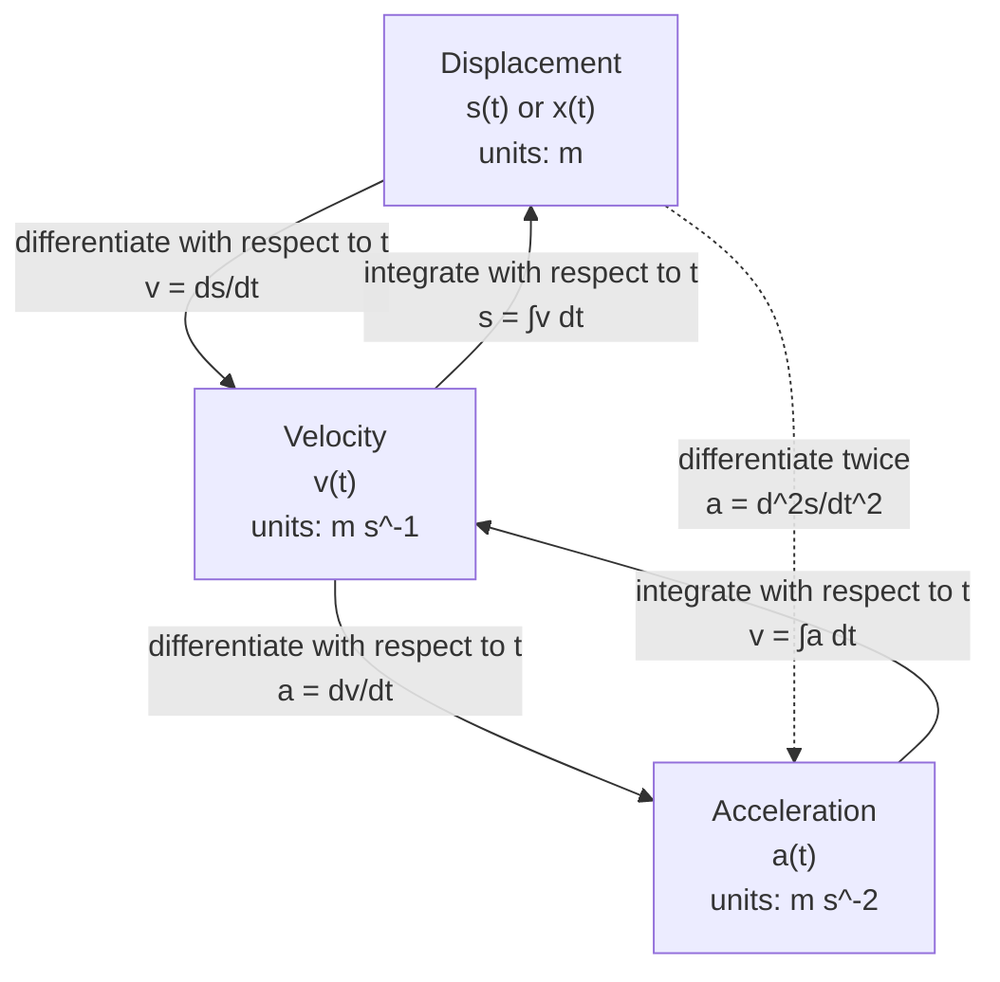

# A22VariableAccelerationMermaid-001

**Asset ID:** `A22VariableAccelerationMermaid-001`  
**Source:** CCEA A22-KIN-LO001; lesson PDF pages on differentiation and integration.  
**Related lesson section:** Core Theory 8.2 and 8.3  
**Purpose:** Show the “differentiate down, integrate up” chain between displacement, velocity and acceleration.

