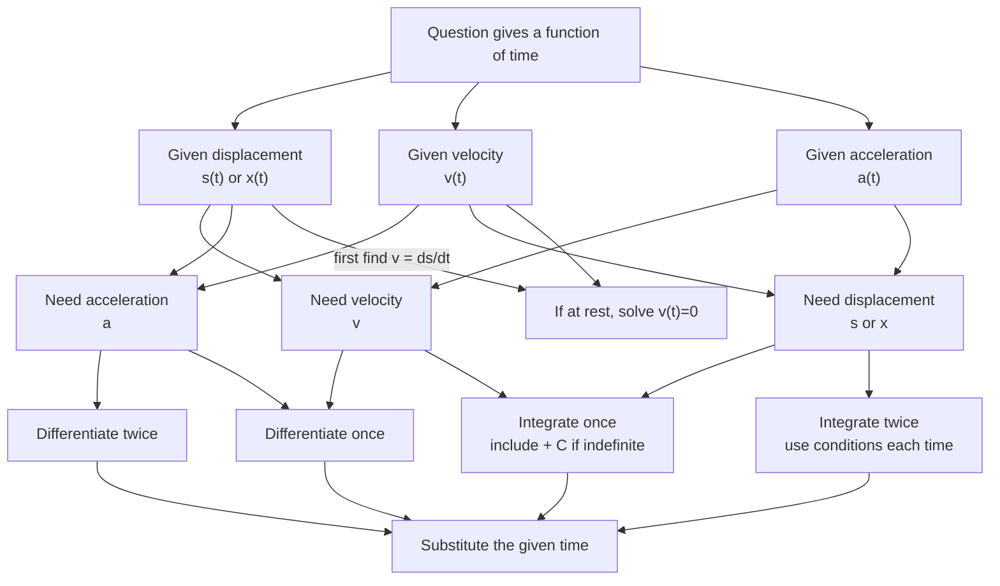

# A22VariableAccelerationMermaid-002

**Asset ID:** `A22VariableAccelerationMermaid-002`  
**Source:** CCEA A22-KIN-LO001; transcript explanation that displacement, velocity or acceleration can be given as functions of time.  
**Related lesson section:** Exam Technique Notes 13.2  
**Purpose:** Help students decide whether to differentiate, integrate, substitute, or solve an equation.

