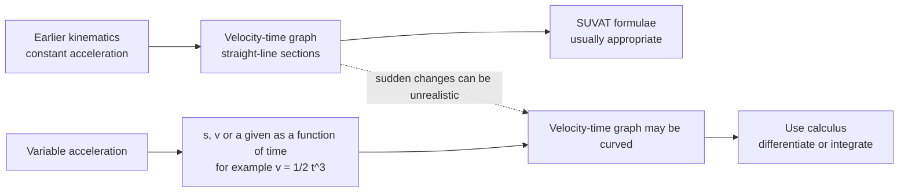

# A22VariableAccelerationMermaid-003

**Asset ID:** `A22VariableAccelerationMermaid-003`  
**Source:** Lesson PDF page 3 and transcript introduction.  
**Related lesson section:** Big Picture Explanation and Core Theory 8.1  
**Purpose:** Compare constant acceleration modelling with variable acceleration modelling.

