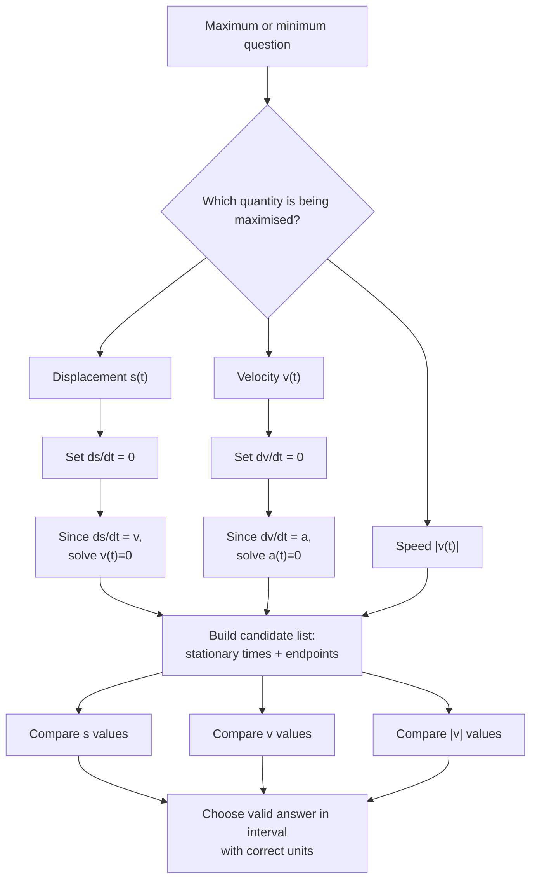

# A22VariableAccelerationMermaid-004

**Asset ID:** `A22VariableAccelerationMermaid-004`  
**Source:** Lesson PDF maxima/minima page and transcript discussion.  
**Related lesson section:** Core Theory 8.6; Common Mistakes 12  
**Purpose:** Show how maximum/minimum displacement and velocity connect to \(v=0\) and \(a=0\), while warning that endpoints still matter.

