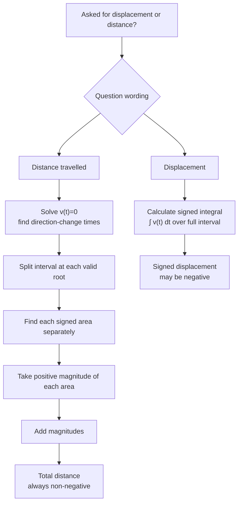

# A22VariableAccelerationMermaid-005

**Asset ID:** `A22VariableAccelerationMermaid-005`  
**Source:** Lesson PDF pages 12 and 13; transcript notes on negative areas and splitting journeys.  
**Related lesson section:** Core Theory 8.7; Worked Examples 9 and 10  
**Purpose:** Distinguish displacement from total distance travelled when velocity changes sign.

