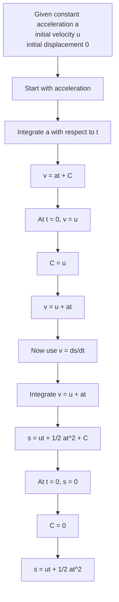

# A22VariableAccelerationMermaid-006

**Asset ID:** `A22VariableAccelerationMermaid-006`  
**Source:** Lesson PDF page 15; transcript derivation of constant acceleration formulae using integration.  
**Related lesson section:** Core Theory 8.8; Worked Example 11  
**Purpose:** Show how \(v=u+at\) and \(s=ut+\frac12at^2\) are derived by integration when acceleration is constant.

