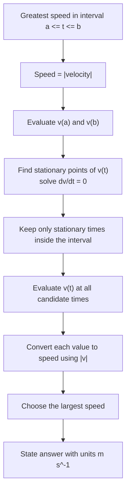

# A22VariableAccelerationMermaid-007

**Asset ID:** `A22VariableAccelerationMermaid-007`  
**Source:** Lesson PDF pages 3, 8 and 9; transcript warnings on greatest speed and graph reasoning.  
**Related lesson section:** Worked Example 2; Worked Example 7; Exam Technique Notes  
**Purpose:** Provide a decision path for greatest-speed questions, especially when velocity is negative.

