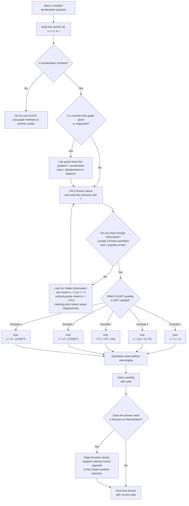

# AS2ConstantAccelerationMermaid-001

## Asset Metadata

| Field | Value |
|---|---|
| asset_id | AS2ConstantAccelerationMermaid-001 |
| file_name | AS2ConstantAccelerationMermaid-001.md |
| asset_type | Mermaid flowchart |
| source | CCEA specification map + Chapter 9 Constant Acceleration transcript |
| related lesson section | Visual and Interactive Asset Plan; Exam Technique Notes; Core Theory: SUVAT Formula Set |
| related LO IDs | AS2-KIN-LO003 |
| purpose | Help students choose the correct SUVAT equation by identifying which quantity is excluded |
| status | Written |

