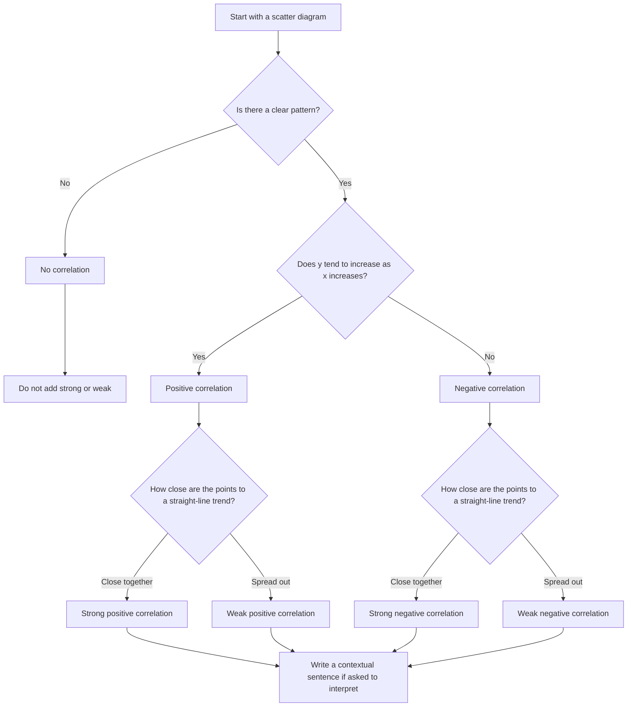

# AS2CorrelationAndRegressionLinesMermaid-001

## Asset ID
`AS2CorrelationAndRegressionLinesMermaid-001`

## Source
CCEA AS2-DPI-LO005 + lesson correlation examples.

## Related Lesson Section
Key Definitions and Notation; Core Theory; Worked Example 1.

## Purpose
Flowchart for classifying correlation by type and strength.

