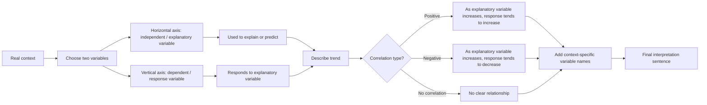

# AS2CorrelationAndRegressionLinesMermaid-002

## Asset ID
`AS2CorrelationAndRegressionLinesMermaid-002`

## Source
CCEA AS2-DPI-LO004 + lesson variable-axis explanation.

## Related Lesson Section
Key Definitions and Notation; Exam Technique Notes.

## Purpose
Flowchart for identifying explanatory and response variables and writing contextual interpretations.

