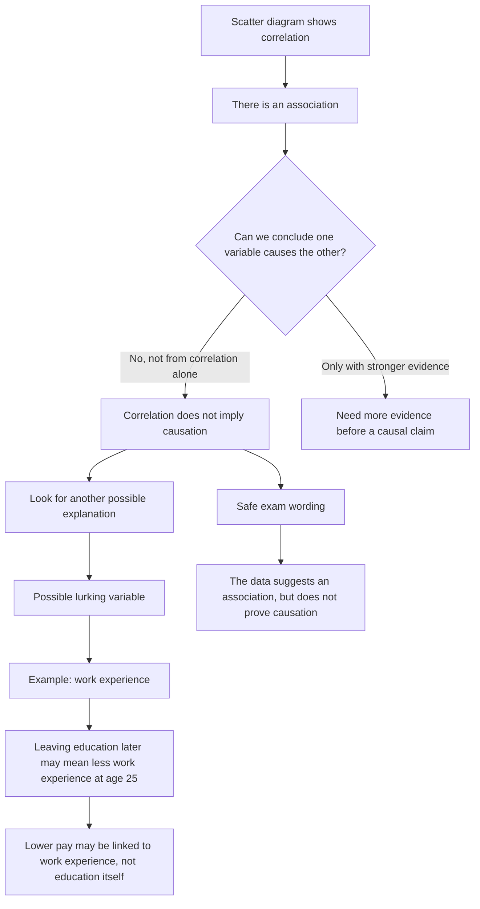

# AS2CorrelationAndRegressionLinesMermaid-003

## Asset ID
`AS2CorrelationAndRegressionLinesMermaid-003`

## Source
CCEA AS2-DPI-LO007 + Hideko causation example.

## Related Lesson Section
Core Theory; Worked Example 3; Common Mistakes.

## Purpose
Causation warning flowchart showing association, causal claim and lurking variable.

