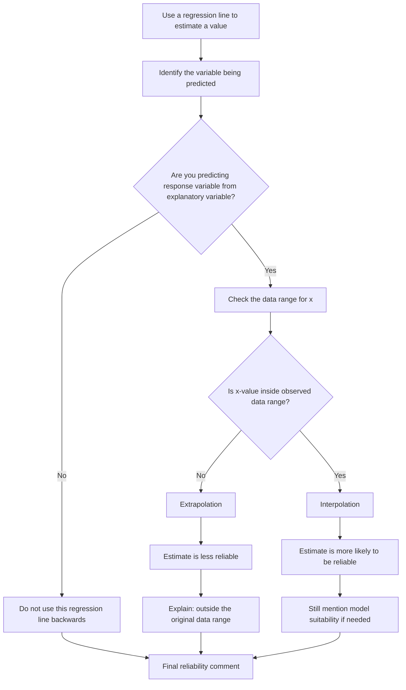

# AS2CorrelationAndRegressionLinesMermaid-005

## Asset ID
`AS2CorrelationAndRegressionLinesMermaid-005`

## Source
CCEA AS2-DPI-LO006 + interpolation/extrapolation lesson evidence.

## Related Lesson Section
Core Theory; Worked Example 6; Exam Technique.

## Purpose
Reliability decision flowchart for interpolation, extrapolation and reverse prediction.

