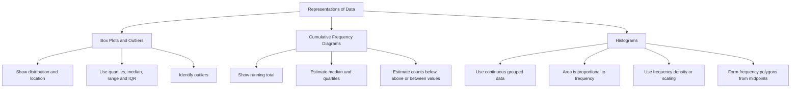

# AS2DataPresentationMERMAID-001

**Asset ID:** AS2DataPresentationMERMAID-001  
**Source:** S1-Chp3-RepresentationsOfData.pdf, chapter overview page 4  
**Related lesson section:** Big Picture Explanation  
**Purpose:** Show how the chapter splits into box plots/outliers, cumulative frequency diagrams and histograms.

