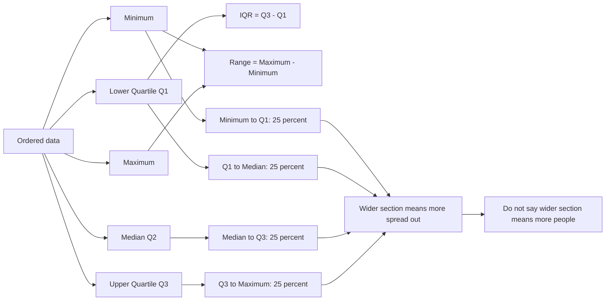

# AS2DataPresentationMERMAID-002

**Asset ID:** AS2DataPresentationMERMAID-002  
**Source:** Box plot recap and interpretation evidence  
**Related lesson section:** Core Theory, Box Plots  
**Purpose:** Explain the components of a box plot and the 25% interpretation trap.

