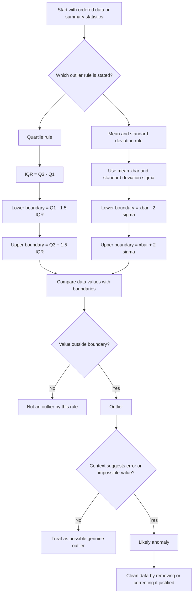

# AS2DataPresentationMERMAID-003

**Asset ID:** AS2DataPresentationMERMAID-003  
**Source:** Outlier rule and anomaly/cleaning data evidence  
**Related lesson section:** Core Theory, Outliers and Cleaning Data  
**Purpose:** Show the decision chain for detecting outliers and deciding whether a value is an anomaly.

