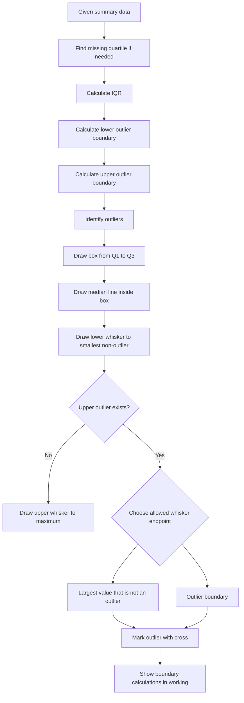

# AS2DataPresentationMERMAID-004

**Asset ID:** AS2DataPresentationMERMAID-004  
**Source:** Box plot drawing example  
**Related lesson section:** Worked Example 5  
**Purpose:** Capture the correct order for constructing a box plot when outliers are present.

