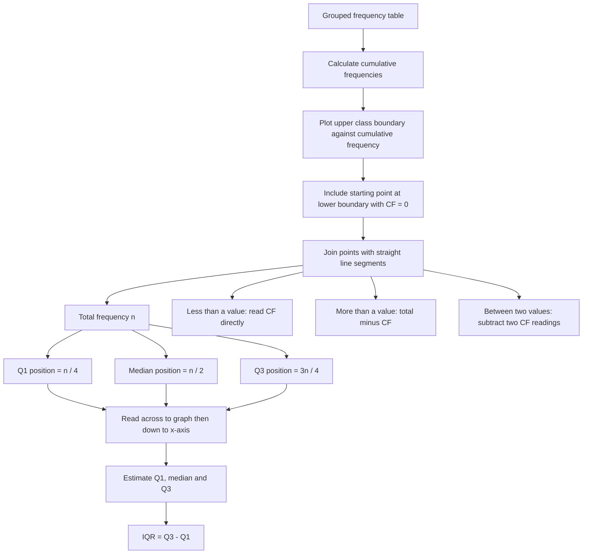

# AS2DataPresentationMERMAID-005

**Asset ID:** AS2DataPresentationMERMAID-005  
**Source:** Cumulative frequency diagram evidence  
**Related lesson section:** Core Theory, Cumulative Frequency Diagrams  
**Purpose:** Show the workflow for plotting and reading cumulative frequency diagrams.

