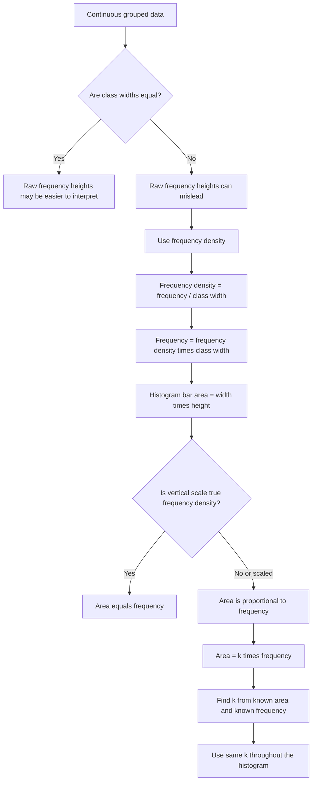

# AS2DataPresentationMERMAID-006

**Asset ID:** AS2DataPresentationMERMAID-006  
**Source:** Histogram recap and A-Level scaling evidence  
**Related lesson section:** Core Theory, Histograms  
**Purpose:** Show why frequency density is needed and how A-Level histogram scaling works.

