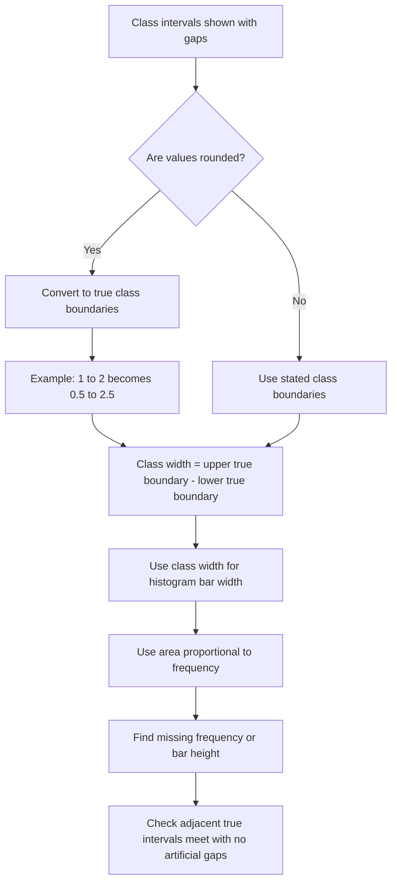

# AS2DataPresentationMERMAID-007

**Asset ID:** AS2DataPresentationMERMAID-007  
**Source:** Histogram gaps evidence  
**Related lesson section:** Core Theory, Gaps and True Class Widths  
**Purpose:** Show how rounded classes and gaps affect true class boundaries and histogram widths.

