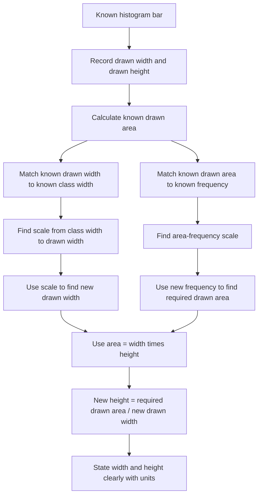

# AS2DataPresentationMERMAID-008

**Asset ID:** AS2DataPresentationMERMAID-008  
**Source:** Width and height of histogram bars evidence  
**Related lesson section:** Worked Examples 15 and 16  
**Purpose:** Show the method for finding the drawn width and drawn height of a histogram bar from a known bar.

