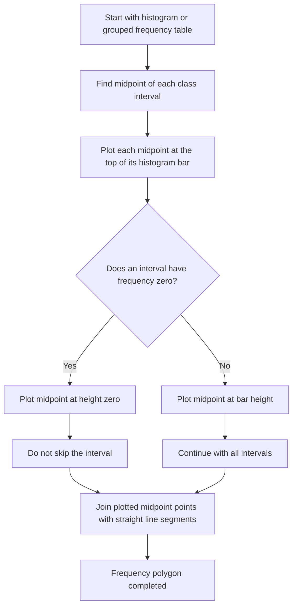

# AS2DataPresentationMERMAID-009

**Asset ID:** AS2DataPresentationMERMAID-009  
**Source:** Frequency polygon evidence  
**Related lesson section:** Core Theory, Frequency Polygons  
**Purpose:** Show how to form a frequency polygon from histogram bars, including zero-frequency intervals.

