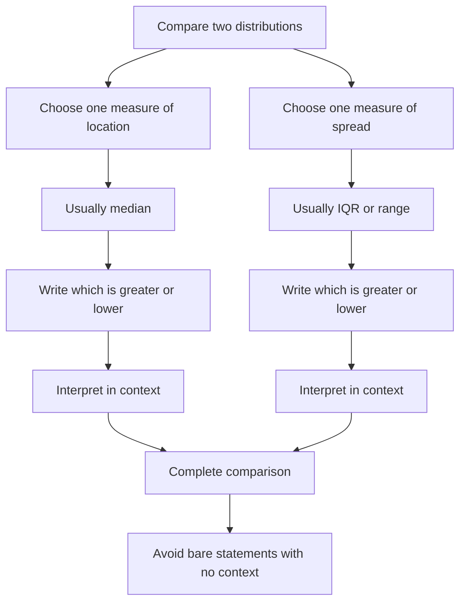

# AS2DataPresentationMERMAID-010

**Asset ID:** AS2DataPresentationMERMAID-010  
**Source:** Comparing box plots and distributions evidence  
**Related lesson section:** Exam Technique, Comparing Distributions  
**Purpose:** Give students a quick decision flow for two-mark comparison questions.

