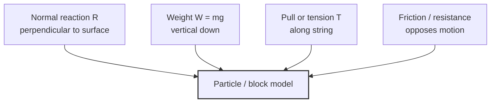

# AS2ForcesAndNewtonsLawsMermaid-001

**Asset ID:** `AS2ForcesAndNewtonsLawsMermaid-001`
**Source:** Chapter 10 Forces and Motion evidence + CCEA AS2-FORCES boundary
**Related lesson section:** Common forces on a particle
**Purpose:** Common forces on a particle.

