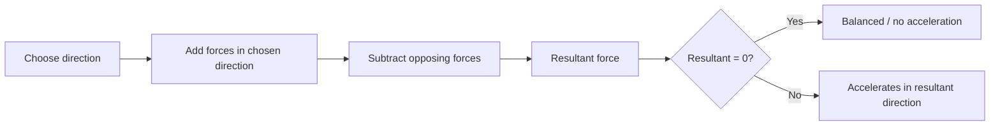

# AS2ForcesAndNewtonsLawsMermaid-002

**Asset ID:** `AS2ForcesAndNewtonsLawsMermaid-002`
**Source:** Chapter 10 Forces and Motion evidence + CCEA AS2-FORCES boundary
**Related lesson section:** Resolving forces to find resultant
**Purpose:** Resolving forces to find resultant.

