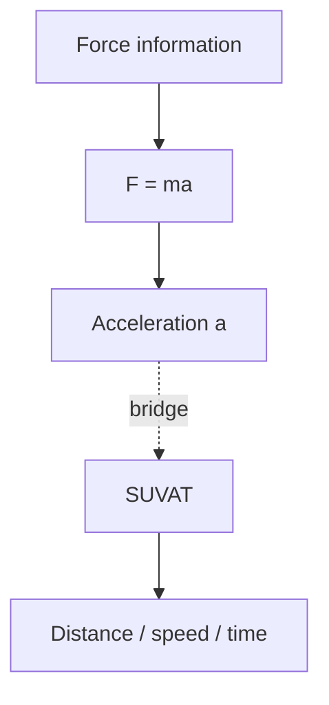

# AS2ForcesAndNewtonsLawsMermaid-005

**Asset ID:** `AS2ForcesAndNewtonsLawsMermaid-005`
**Source:** Chapter 10 Forces and Motion evidence + CCEA AS2-FORCES boundary
**Related lesson section:** F=ma and SUVAT bridge
**Purpose:** F=ma and SUVAT bridge.

