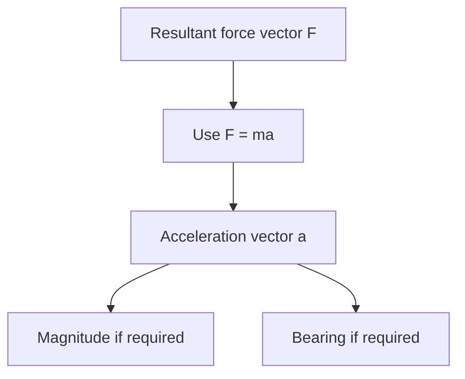

# AS2ForcesAndNewtonsLawsMermaid-006

**Asset ID:** `AS2ForcesAndNewtonsLawsMermaid-006`
**Source:** Chapter 10 Forces and Motion evidence + CCEA AS2-FORCES boundary
**Related lesson section:** Vector F=ma
**Purpose:** Vector F=ma.

