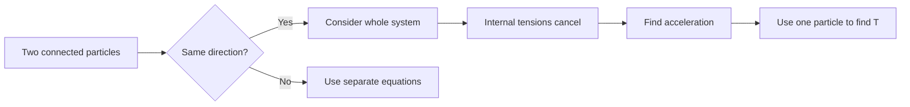

# AS2ForcesAndNewtonsLawsMermaid-007

**Asset ID:** `AS2ForcesAndNewtonsLawsMermaid-007`
**Source:** Chapter 10 Forces and Motion evidence + CCEA AS2-FORCES boundary
**Related lesson section:** Connected particles whole system
**Purpose:** Connected particles whole system.

