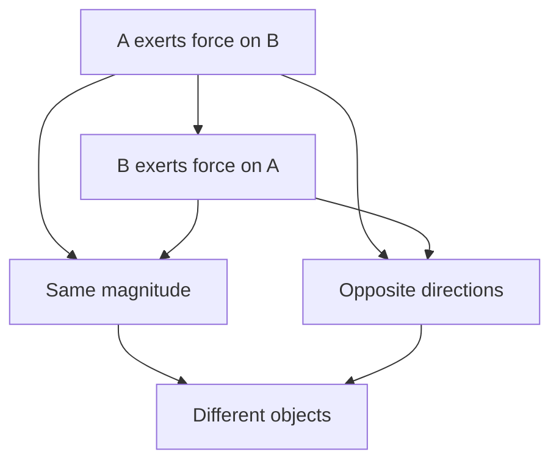

# AS2ForcesAndNewtonsLawsMermaid-008

**Asset ID:** `AS2ForcesAndNewtonsLawsMermaid-008`
**Source:** Chapter 10 Forces and Motion evidence + CCEA AS2-FORCES boundary
**Related lesson section:** Newton third law
**Purpose:** Newton third law.

