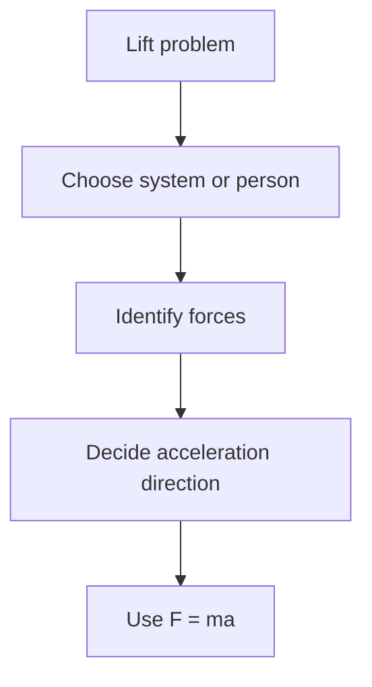

# AS2ForcesAndNewtonsLawsMermaid-009

**Asset ID:** `AS2ForcesAndNewtonsLawsMermaid-009`
**Source:** Chapter 10 Forces and Motion evidence + CCEA AS2-FORCES boundary
**Related lesson section:** Lift problem flow
**Purpose:** Lift problem flow.

