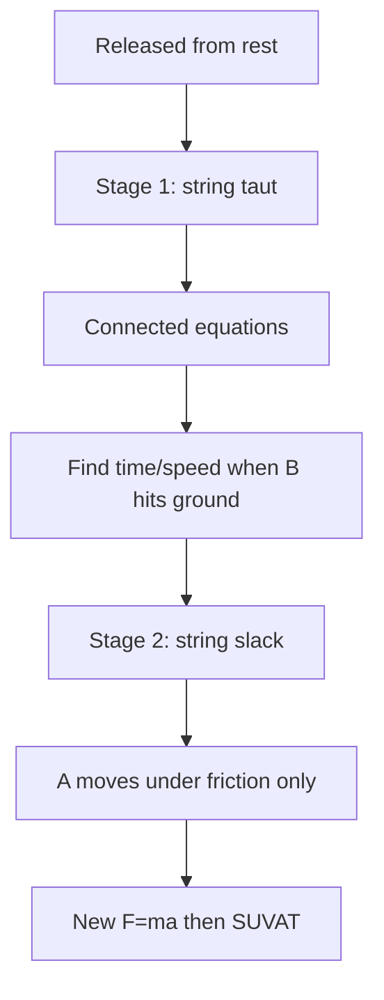

# AS2ForcesAndNewtonsLawsMermaid-011

**Asset ID:** `AS2ForcesAndNewtonsLawsMermaid-011`
**Source:** Chapter 10 Forces and Motion evidence + CCEA AS2-FORCES boundary
**Related lesson section:** Two-stage pulley motion
**Purpose:** Two-stage pulley motion.

