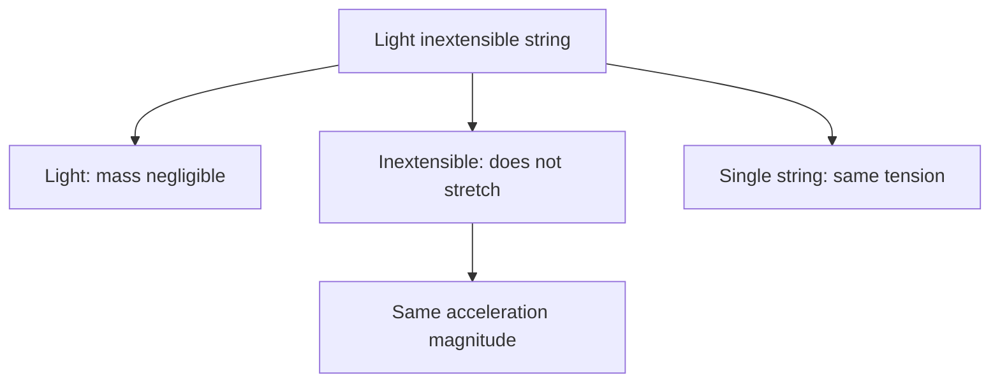

# AS2ForcesAndNewtonsLawsMermaid-012

**Asset ID:** `AS2ForcesAndNewtonsLawsMermaid-012`
**Source:** Chapter 10 Forces and Motion evidence + CCEA AS2-FORCES boundary
**Related lesson section:** Light inextensible string assumptions
**Purpose:** Light inextensible string assumptions.

