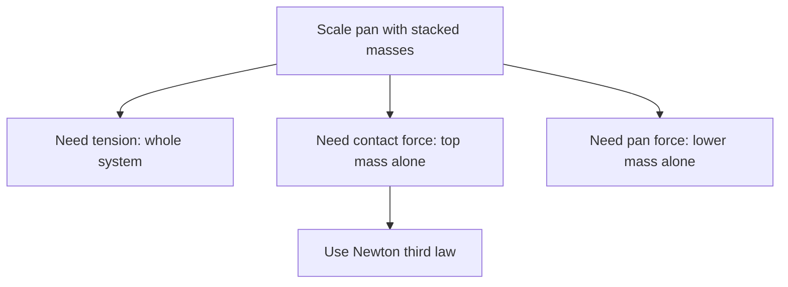

# AS2ForcesAndNewtonsLawsMermaid-013

**Asset ID:** `AS2ForcesAndNewtonsLawsMermaid-013`
**Source:** Chapter 10 Forces and Motion evidence + CCEA AS2-FORCES boundary
**Related lesson section:** Scale pan object selection
**Purpose:** Scale pan object selection.

