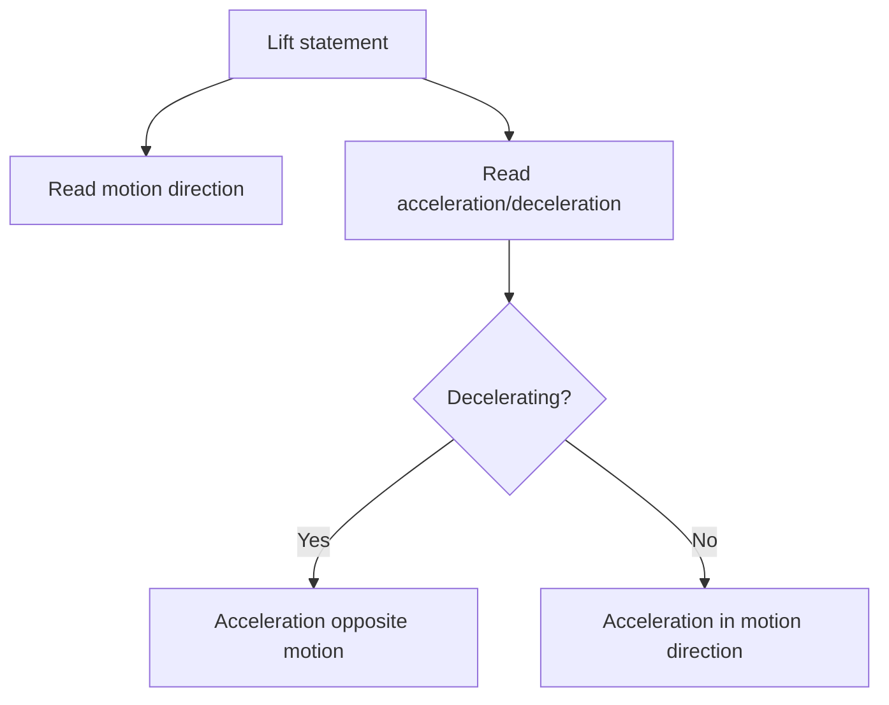

# AS2ForcesAndNewtonsLawsMermaid-014

**Asset ID:** `AS2ForcesAndNewtonsLawsMermaid-014`
**Source:** Chapter 10 Forces and Motion evidence + CCEA AS2-FORCES boundary
**Related lesson section:** Motion versus acceleration
**Purpose:** Motion versus acceleration.

