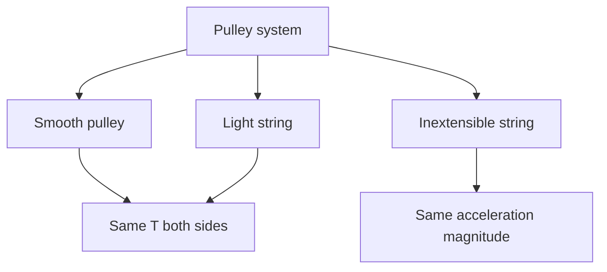

# AS2ForcesAndNewtonsLawsMermaid-015

**Asset ID:** `AS2ForcesAndNewtonsLawsMermaid-015`
**Source:** Chapter 10 Forces and Motion evidence + CCEA AS2-FORCES boundary
**Related lesson section:** Smooth pulley assumptions
**Purpose:** Smooth pulley assumptions.

