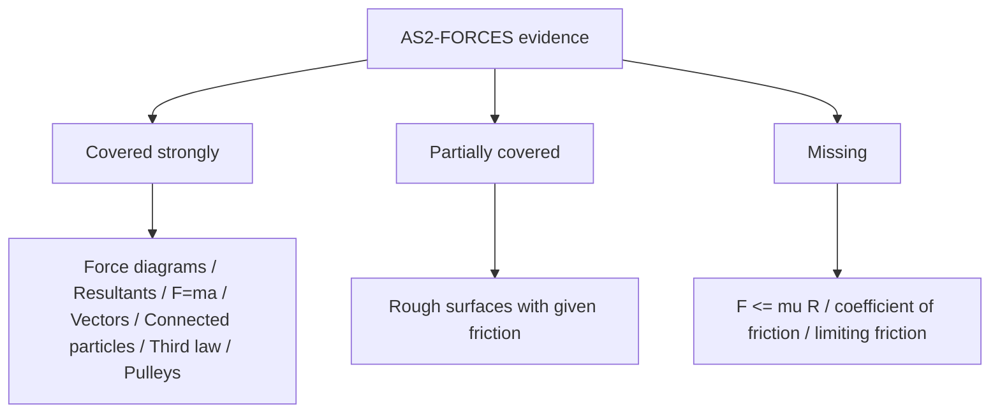

# AS2ForcesAndNewtonsLawsMermaid-016

**Asset ID:** `AS2ForcesAndNewtonsLawsMermaid-016`
**Source:** Chapter 10 Forces and Motion evidence + CCEA AS2-FORCES boundary
**Related lesson section:** Coverage gap map
**Purpose:** Coverage gap map.

