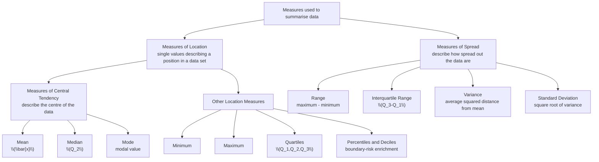

# AS2MeasuresLocationSpreadMermaid-001

## Asset ID
`AS2MeasuresLocationSpreadMermaid-001`

## Source
CCEA AS2-DPI specification map; Chapter 2 Measures of Location & Spread transcript; Phase 1 lesson section: Measures of Location and Measures of Spread.

## Purpose
Show central tendency as part of location, and separate it from spread.

