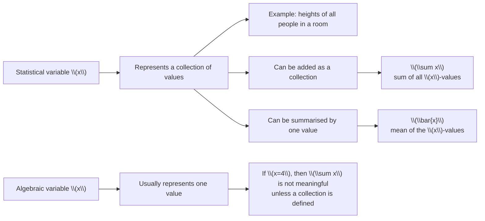

# AS2MeasuresLocationSpreadMermaid-002

## Asset ID
`AS2MeasuresLocationSpreadMermaid-002`

## Source
Chapter 2 transcript, variable notation explanation.

## Purpose
Clarify that `x` in statistics can represent a collection of values, while `x-bar` is one single summary value.

