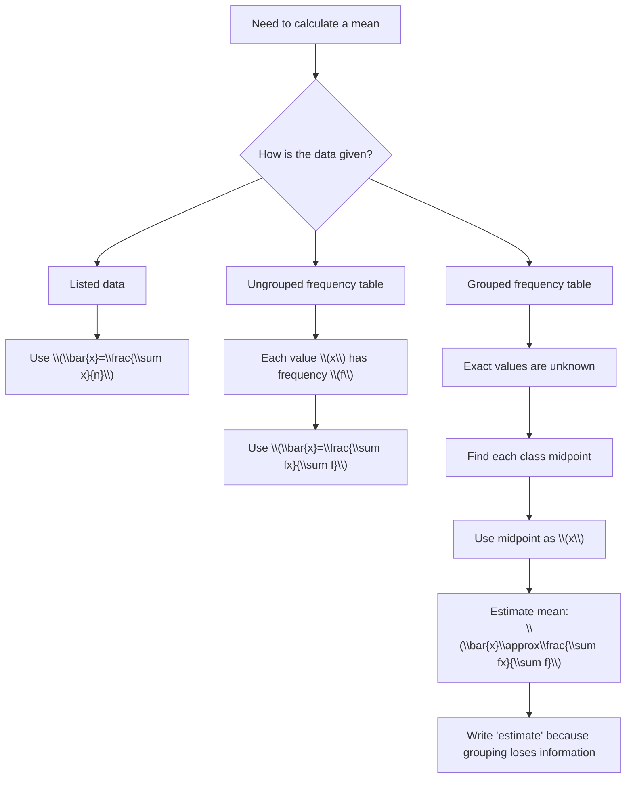

# AS2MeasuresLocationSpreadMermaid-003

## Asset ID
`AS2MeasuresLocationSpreadMermaid-003`

## Purpose
Show the decision path for choosing the correct mean formula.

```mermaid
flowchart TD
    A["Need to calculate a mean"] --> B{"How is the data given?"}
    B --> C["Listed data"]
    C --> D["Use \\(\\bar{x}=\\frac{\\sum x}{n}\\)"]
    B --> E["Ungrouped frequency table"]
    E --> F["Each value \\(x\\) has frequency \\(f\\)"]
    F --> G["Use \\(\\bar{x}=\\frac{\\sum fx}{\\sum f}\\)"]
    B --> H["Grouped frequency table"]
    H --> I["Exact values are unknown"]
    I --> J["Find each class midpoint"]
    J --> K["Use midpoint as \\(x\\)"]
    K --> L["Estimate mean:<br/>\\(\\bar{x}\\approx\\frac{\\sum fx}{\\sum f}\\)"]
    L --> M["Write 'estimate' because grouping loses information"]
```
