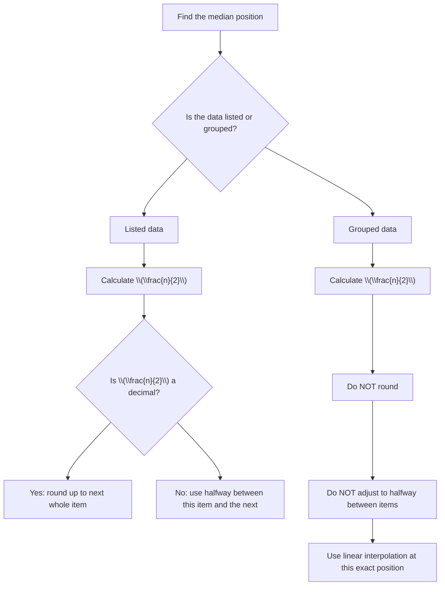

# AS2MeasuresLocationSpreadMermaid-004

## Asset ID
`AS2MeasuresLocationSpreadMermaid-004`

## Purpose
Show the difference between listed-data median rules and grouped-data median rules.

```mermaid
flowchart TD
    A["Find the median position"] --> B{"Is the data listed or grouped?"}
    B --> C["Listed data"]
    C --> D["Calculate \\(\\frac{n}{2}\\)"]
    D --> E{"Is \\(\\frac{n}{2}\\) a decimal?"}
    E --> F["Yes: round up to next whole item"]
    E --> G["No: use halfway between this item and the next"]
    B --> H["Grouped data"]
    H --> I["Calculate \\(\\frac{n}{2}\\)"]
    I --> J["Do NOT round"]
    J --> K["Do NOT adjust to halfway between items"]
    K --> L["Use linear interpolation at this exact position"]
```
