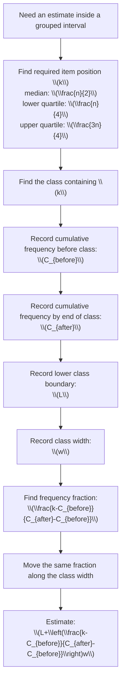

# AS2MeasuresLocationSpreadMermaid-005

## Asset ID
`AS2MeasuresLocationSpreadMermaid-005`

## Purpose
Give the full interpolation calculation workflow.

```mermaid
flowchart TD
    A["Need an estimate inside a grouped interval"] --> B["Find required item position \\(k\\)<br/>median: \\(\\frac{n}{2}\\)<br/>lower quartile: \\(\\frac{n}{4}\\)<br/>upper quartile: \\(\\frac{3n}{4}\\)"]
    B --> C["Find the class containing \\(k\\)"]
    C --> D["Record cumulative frequency before class:<br/>\\(C_{before}\\)"]
    D --> E["Record cumulative frequency by end of class:<br/>\\(C_{after}\\)"]
    E --> F["Record lower class boundary:<br/>\\(L\\)"]
    F --> G["Record class width:<br/>\\(w\\)"]
    G --> H["Find frequency fraction:<br/>\\(\\frac{k-C_{before}}{C_{after}-C_{before}}\\)"]
    H --> I["Move the same fraction along the class width"]
    I --> J["Estimate:<br/>\\(L+\\left(\\frac{k-C_{before}}{C_{after}-C_{before}}\\right)w\\)"]
```
