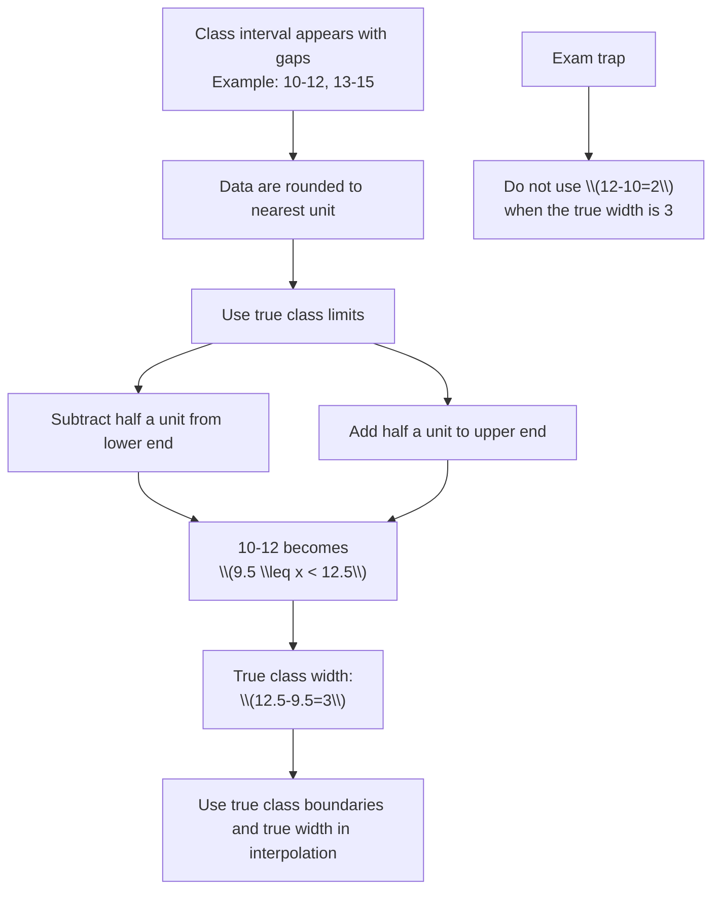

# AS2MeasuresLocationSpreadMermaid-006

## Asset ID
`AS2MeasuresLocationSpreadMermaid-006`

## Purpose
Show why rounded class intervals must be converted before interpolation.

```mermaid
flowchart TD
    A["Class interval appears with gaps<br/>Example: 10-12, 13-15"] --> B["Data are rounded to nearest unit"]
    B --> C["Use true class limits"]
    C --> D["Subtract half a unit from lower end"]
    C --> E["Add half a unit to upper end"]
    D --> F["10-12 becomes<br/>\\(9.5 \\leq x < 12.5\\)"]
    E --> F
    F --> G["True class width:<br/>\\(12.5-9.5=3\\)"]
    G --> H["Use true class boundaries and true width in interpolation"]
    I["Exam trap"] --> J["Do not use \\(12-10=2\\)<br/>when the true width is 3"]
```
