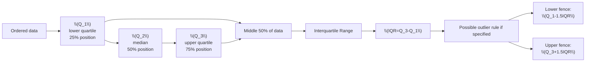

# AS2MeasuresLocationSpreadMermaid-007

## Asset ID
`AS2MeasuresLocationSpreadMermaid-007`

## Purpose
Show quartiles, IQR, and their connection to possible outlier rules.

```mermaid
flowchart LR
    A["Ordered data"] --> B["\\(Q_1\\)<br/>lower quartile<br/>25% position"]
    B --> C["\\(Q_2\\)<br/>median<br/>50% position"]
    C --> D["\\(Q_3\\)<br/>upper quartile<br/>75% position"]
    B --> E["Middle 50% of data"]
    D --> E
    E --> F["Interquartile Range"]
    F --> G["\\(IQR=Q_3-Q_1\\)"]
    G --> H["Possible outlier rule if specified"]
    H --> I["Lower fence:<br/>\\(Q_1-1.5IQR\\)"]
    H --> J["Upper fence:<br/>\\(Q_3+1.5IQR\\)"]
```
