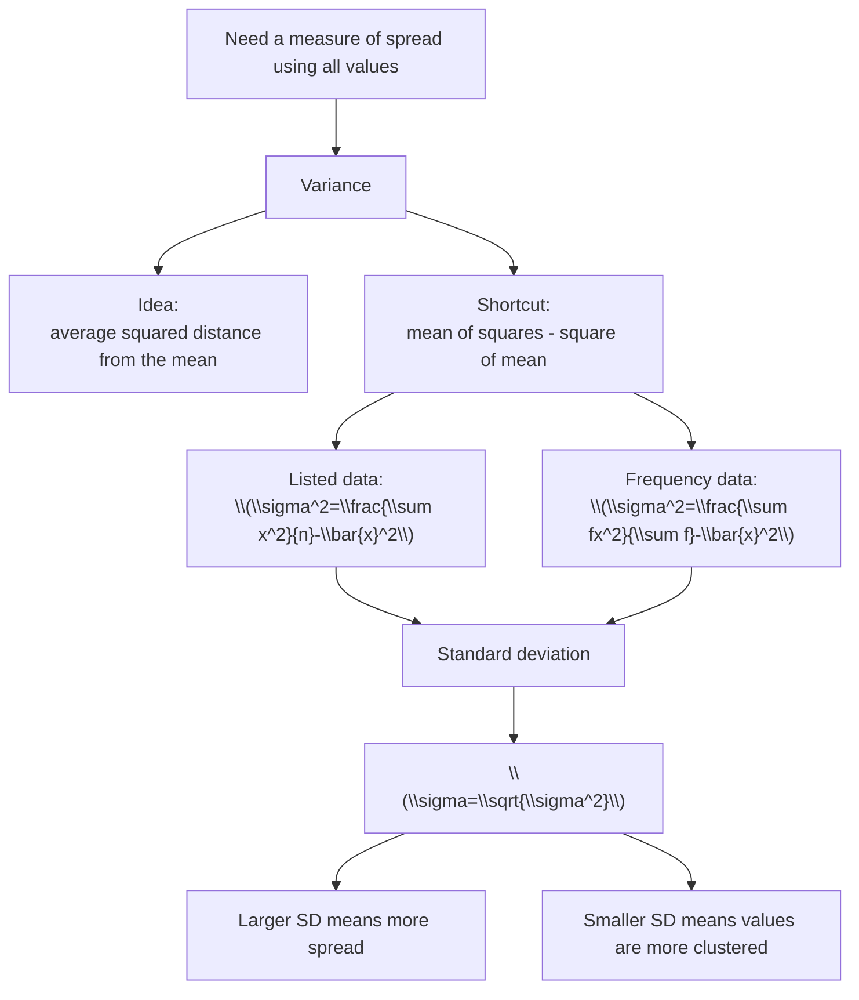

# AS2MeasuresLocationSpreadMermaid-008

## Asset ID
`AS2MeasuresLocationSpreadMermaid-008`

## Purpose
Show variance as mean of squares minus square of mean, and standard deviation as the square root of variance.

